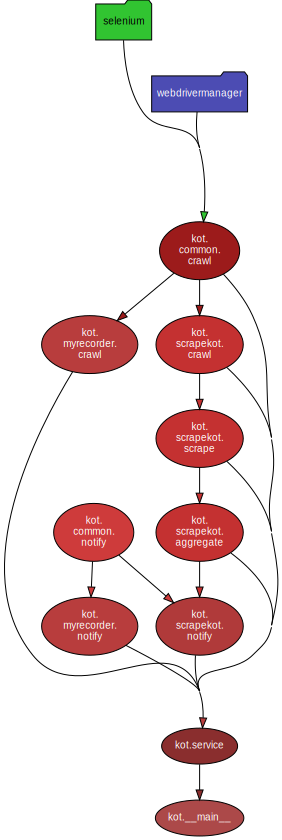

# kot

## TOC

- [TOC](#TOC)
- [概要](#概要)
- [実行環境の準備](#実行環境の準備)
- [Scrape KOT](#scrape-kot)
  - [Slack に通知](#slack-に通知)
  - [Console に通知](#console-に通知)
  - [AWS Lambda で実行](#aws-lambda-で実行)
- [My Recorder](#my-recorder)
  - [実行例](#console-に通知)
  - [AWS Lambda で実行](#aws-lambda-で実行)
- [Development](#development)
  - [Setup](#setup)
  - [Lint](#lint)
  - [Test](#test)
  - [Typer Help](#typer-help)
  - [Pydeps](#pydeps)

## 概要

以下の機能が CLI で操作できる

- KING OF TIME の勤怠データから勤務時間の貯金時間等を計算する
- My レコーダーで打刻する

## 実行環境の準備

```shell
$ git clone https://github.com/takaiyuk/kot.git
$ cd kot
$ mkdir ~/.kot
# config.yaml を適宜書き換える
$ cp ./config.yaml.example ~/.kot/config.yaml
$ make build
```

**NOTE**

- ローカルでの実行は Arm64 の MacOS のみサポートしている

## Scrape KOT

### Slack に通知

```shell
$ make scrapekot-slack
```

- 出力イメージ


### Console に通知

Slack チャンネルに通知させたくない場合は実行のコンソール上のみに出力させることも可能

```shell
$ make scrapekot
```

- 出力イメージ

```
    残り12営業日: (8.0/20.0 日)

    あと94時間34分必要: (65時間26分/160時間)

    貯金: 1時間26分

    貯金を元に残り営業日の必要勤務時間数を算出すると: 7時間52分

    2019-11-14の出勤・定時
        出勤: 10:15
        定時: 19:15
```

### AWS Lambda で実行

AWS Lambda で動かすためにコンテナイメージを利用して Lambda 関数コードをデプロイすることができる（ref. [コンテナイメージで Python Lambda 関数をデプロイする](https://docs.aws.amazon.com/ja_jp/lambda/latest/dg/python-image.html)）

`.env` で定義したイメージレポジトリをあらかじめ作成しておく必要がある

```shell
# .env を適宜書き換える
$ cp scripts/docker/lambda/.env.example scripts/docker/lambda/.env
$ ./scripts/docker/lambda/build.sh
$ ./scripts/docker/lambda/push.sh
```

**NOTE: AWS Lambda で環境変数の設定が必要**

CLI で以下のようにして例えば `kot` という名前の関数に環境変数を設定できる

```shell
$ aws lambda update-function-configuration --function-name kot \
    --environment "Variables={ACCOUNT_ID=id,ACCOUNT_PAWSSWORD=password,MYRECORDER_SLACK_WEBHOOK_URL=webhook_url,MYRECORDER_SLACK_CHANNEL=channel,MYRECORDER_SLACK_ICON_EMOJI=icon_emoji,MYRECORDER_SLACK_USERNAME=usename,SCRAPEKOT_SLACK_WEBHOOK_URL=webhook_url,SCRAPEKOT_SLACK_CHANNEL=channel,SCRAPEKOT_SLACK_ICON_EMOJI=icon_emoji,SCRAPEKOT_SLACK_USERNAME=usename}"
```

以下のコマンドで現在の設定を取得できる

```shell
$ aws lambda get-function-configuration --function-name kot
```

以下のコマンドで実行できる

```shell
$ aws lambda invoke --function-name kot --cli-binary-format raw-in-base64-out --payload '{ "command": "scrape" }' /dev/stdout
```

## My Recorder

利用可能なオプションは以下の通り

- `start`: 出勤
- `end`: 退勤
- `rest_start`: 休憩開始
- `rest_end`: 休憩終了

### 実行例

- 出勤

```shell
$ make myrecorder-start
```

- 退勤

```shell
$ make myrecorder-end
```

- 休憩開始

```shell
$ make myrecorder-rest-start
```

- 休憩終了

```shell
$ make myrecorder-rest-end
```

### AWS Lambda で実行

`myrecorder_command` で上記のオプションを指定する

```shell
$ aws lambda invoke --function-name kot --cli-binary-format raw-in-base64-out --payload '{ "command": "myrecorder", "myrecorder_command": "start" }' /dev/stdout
```

## Development

### Setup

```shell
$ poetry install
```

### Lint

```shell
$ make lint
```

### Test

```shell
$ make test
```

### Typer Help

```
$ poetry run python -m kot --help
Usage: python -m kot [OPTIONS] COMMAND [ARGS]...

Options:
  --help  Show this message and exit.

Commands:
  initialize  Get cache of the latest chromedriver version for chromium...
  myrecorder
  scrape
```

```
$ poetry run python -m kot scrape --help
Usage: python -m kot scrape [OPTIONS]

Options:
  --console / --no-console        [default: console]
  --amazon-linux / --no-amazon-linux
                                  [default: no-amazon-linux]
  --browser-kind [chrome|chromium|firefox|remote]
                                  [default: BrowserKind.chrome]
  --headless / --no-headless      [default: headless]
  --help                          Show this message and exit.
```

```
$ poetry run python -m kot myrecorder --help
Usage: python -m kot myrecorder [OPTIONS] COMMAND

Arguments:
  COMMAND  [required]

Options:
  --yes / --no-yes                [default: no-yes]
  --message TEXT
  --debug / --no-debug            [default: no-debug]
  --amazon-linux / --no-amazon-linux
                                  [default: no-amazon-linux]
  --browser-kind [chrome|chromium|firefox|remote]
                                  [default: BrowserKind.chrome]
  --headless / --no-headless      [default: headless]
  --help                          Show this message and exit.
```

### Pydeps

```shell
$ make pydeps
```

<details>
<summary>Dependency Visualization</summary>

</details>
